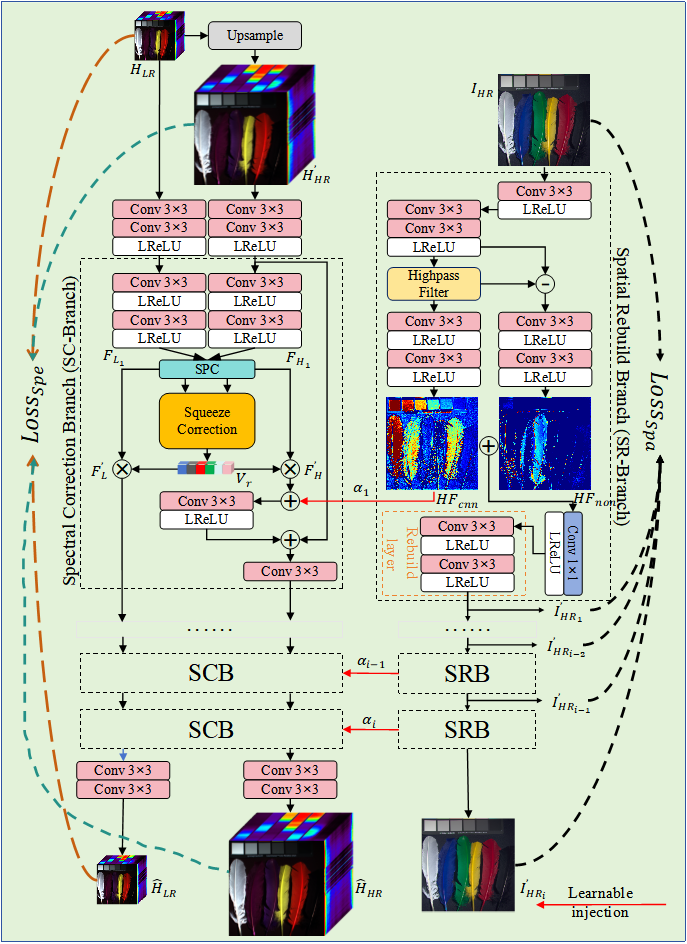
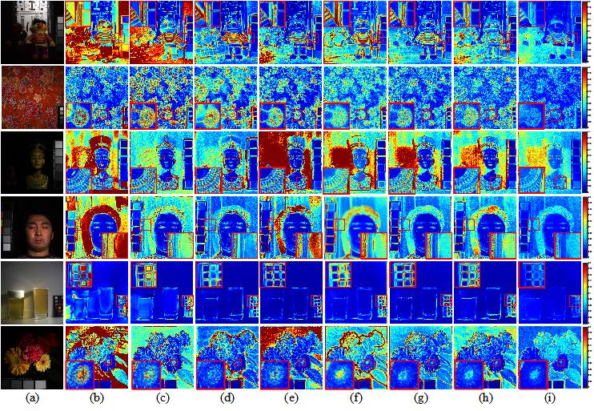
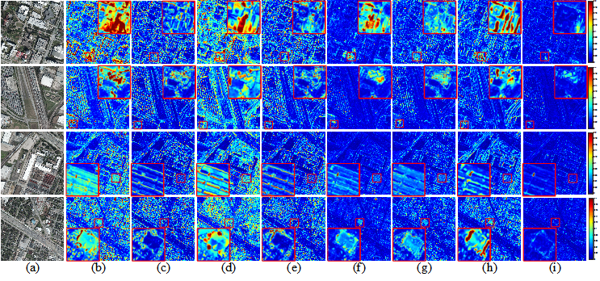
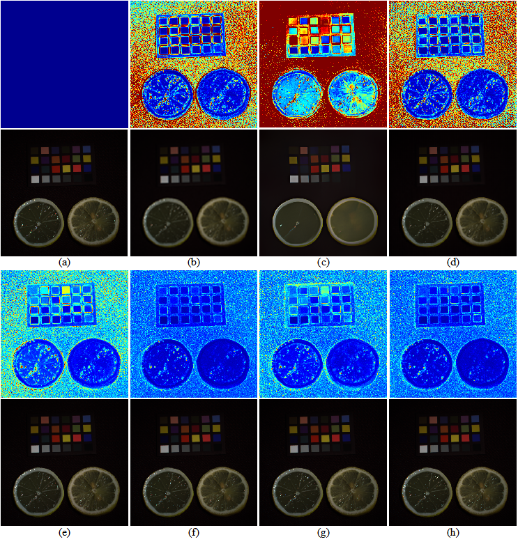

# Dual-Branch-Spectral-High-Frequency-Fusion-and-Correction-Network-for-Hyperspectral-image-fusion 

Implementation of Paper: "Dual-Branch-Spectral-High-Frequency-Fusion-and-Correction-Network-for-Hyperspectral-image-fusion" (DSHFCN) in PyTorch

## Prepare Training Dataset

1. CAVE:  [website](https://www1.cs.columbia.edu/CAVE/databases/multispectral/)
2. Houston: [website](https://hyperspectral.ee.uh.edu/?page_id=1075)

## Network Structure

  

## Experimental Result
#### CAVE:

  

Fig. SAM distribution of partial data in CAVE by different methods. (a) RGB, (b) CNMF, (c) Bayesian, (d) GFPCA, (e) DDLPS, (f) GuidedNet, (g) ADKNet, (h) BUSIFusion, (i) the proposed method. Color bar range is [0,0.2] to highlight the spectral differences more clearly.

#### Houston:

  

Fig. SAM distribution of partial data in Houston by different methods. (a) RGB, (b) CNMF, (c) Bayesian, (d) GFPCA, (e) DDLPS, (f) GuidedNet, (g) ADKNet, (h) BUSIFusion, (i) the proposed method. Color bar range is [0,0.2] to highlight the spectral differences more clearly.

## Further Result
Natural image superresolution (SR) model applied in our method.

  

Fig. The results of different SR models. (a) Ground Truth, (b) Bicubic, (c) ESRNet, (d) LapSRN, (e) Piexlshuffle + DSHFCN, (f) (b) + DSHFCN (default), (g) (c) + DSHFCN, (h) (d) + DSHFCN. The first line is the spectral distortion map, where the color bar range is [0,0.2], and the second line is the visual HSI from the CAVE dataset, where [r,g,b]=[30,20,10].

## Training Code
 coming soon...
